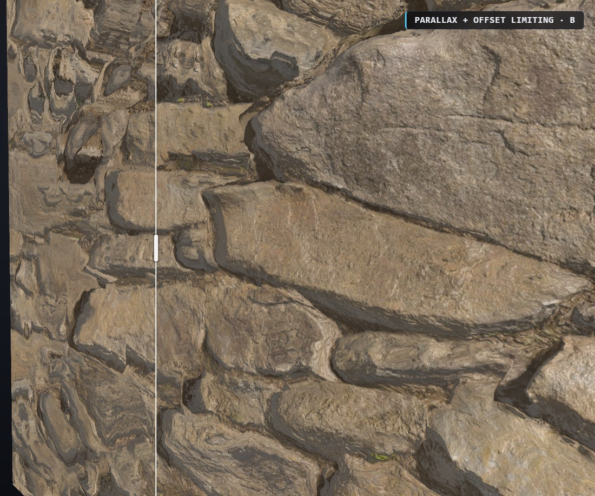

# Parallax mapping vs. real displacement

Games fake surface detail. A brick wall is usually one flat polygon, and the
bumps are an illusion painted on by the shader. There is a family of techniques
for this, they cost wildly different amounts, and they fail in different ways.

This is an interactive demo of that family, side by side on the same surface, so
you can see exactly what each one buys and where each one breaks.

**It runs in your browser — [open the live demo](https://mfagerlund.github.io/parallax-mapping-demo/).
Nothing to download, install, or build.**


*Same height field, same camera, same light. Left: the relief is convincing, but
the outline is still a perfect cylinder — the illusion is confined to the inside
of the shape. Right: stones break the outline.*

## Try it

### **[→ Live demo](https://mfagerlund.github.io/parallax-mapping-demo/)**

Or clone the repo and open `index.html` directly — no server, no build step, no
network, no install.

- **Drag** to orbit, **wheel** to zoom.
- **Technique** picks the two shaders being compared; **drag the white handle**
  to move the split.
- **Compare presets** are shortcuts that set both dropdowns to a pairing that
  demonstrates something specific.
- **Geometry** picks what the material is wrapped around. The *wall* has no
  outline to break, the *tower* is the classic curved silhouette, and the *cube*
  is the corner case — the one that separates techniques that fake an outline
  from techniques that fake a surface.

## The short version of the problem

You have a flat polygon and a **height map** — a greyscale image saying how far
in or out the real surface would be at each point.

The cheapest trick, **normal mapping**, uses that height map only to bend the
lighting. It looks like relief until the light or camera moves, because nothing
actually moved.

**Parallax mapping** goes further: it shifts the texture lookup based on your
viewing angle, so nearer bumps appear to slide over farther ones. Cheap, and
convincing head-on.

**Parallax occlusion mapping (POM)** walks a ray through the height field to find
the first thing it hits. Now bumps properly hide each other and cast into their
own crevices. This is what most games mean by "parallax."

All of the above share one hard limit: **they cannot change the outline.** The
shape's silhouette is its polygon edge, so relief can only ever happen *inside*
the shape. A cobbled cylinder stays a perfect cylinder in profile.

Beating that requires one of three things: **real displaced geometry** — actually
subdividing the mesh and moving vertices, which is what tessellation does — or a
per-pixel trick that discards fragments where the ray escapes the surface
entirely, which is what this demo calls **silhouette POM** — or **screen-space
displacement**, which builds real geometry but takes its subdivision from the
framebuffer instead of the mesh.

Quality settings in shipping games routinely swap between these tiers, which is
why a "model quality" slider can change how a wall's edge looks, not just its
texture. Crimson Desert is one public example: it drops tessellation at Low and
[substitutes parallax](https://steamcommunity.com/app/3321460/discussions/0/805721252880897880/),
and it also ships a *Screen Space Displacement* setting of its own. It runs on
Pearl Abyss's proprietary
[BlackSpace Engine](https://80.lv/articles/pearl-abyss-demonstrated-crimson-desert-s-blackspace-engine-tech-advancements),
and nothing here is a claim about its internals — mode 6 below is this repo's
reading of a public technique, not a reconstruction of theirs.

## The seven modes

| # | Mode | What it shows |
|---|---|---|
| 0 | Normal mapping only | Lighting-only relief. Flat the moment anything moves. |
| 1 | Parallax, naive | Divides by the view angle. Explodes at grazing angles. |
| 2 | Parallax + offset limiting | Welsh 2004. One deleted division; enormous improvement. |
| 3 | Steep parallax | Ray march without interpolation. Visible terracing. |
| 4 | Parallax occlusion mapping | Same march, interpolated. The usual production choice. |
| 5 | Silhouette POM | Marches in object space, so rays can miss entirely and cut the outline. |
| 6 | Screen-space displacement | Displaces a screen-resolution grid. Real geometry, real depth, screen-space failures. |

### Normal mapping vs. POM


Both halves use the identical normal map. The left only *shades* the relief; the
right displaces the texture lookup, so stones occlude each other and joints gain
real depth. The cheapest large win in the whole ladder.

### Why offset limiting exists



*Left: naive parallax. Right: offset-limited.* Viewed at a shallow angle, the
naive version divides by a number approaching zero, the texture offset runs away,
and the surface liquefies. The 2004 fix is to simply delete that division — which
is geometrically wrong and looks far better. That single change is the entire
difference between these two halves.

### Why nobody ships steep parallax


At 10 samples the un-interpolated march quantises the surface into visible
terraces. Interpolating between the last two samples removes them for
approximately no cost.

## Screen-space displacement

Mode 6 is the odd one out, and the only member of the family that is not a
relief shader at all. Two passes:

1. Rasterize the undisplaced hull into a G-buffer holding its world position.
   A deferred renderer already has this.
2. Draw a grid of triangles **one cell per screen pixel**. Each grid node reads
   the hull position under it, pushes it along the surface normal by the height
   map, and projects the result.

So it really is displaced geometry — it just takes its subdivision from the
framebuffer instead of the mesh. That is the whole "infinite detail without the
memory cost" claim: there is no subdivided mesh to author, store or stream, and
picking a tessellation rate — the hard part of tessellation, which screen-space
tessellation heuristics exist to approximate — comes out exactly right by
construction, everywhere, for free.

Three things follow that no other mode here gets:

- **Correct depth.** The rasterizer wrote it. Mode 5 fakes its outline with
  `discard` and leaves the *undisplaced hull's* depth in the buffer — silently
  wrong, and wrong for every consumer downstream. This just does not have that
  problem, which deletes most of the objection list further down this file.
- **Cost decoupled from content.** Every pixel does exactly one displacement.
  Turn on the heatmap and mode 6 reads uniformly flat while POM shows red
  streaks down every joint. POM's cost also scales with the Depth slider and
  with how flat the view is; this is indifferent to both.
- **It generalises.** Mode 5 is exact only because a cylinder and a slab have
  closed-form ray intersections. Mode 6 needs nothing but position, normal and
  height per pixel — any mesh, skinned characters, decals.

### Where it fails, and why it is all one reason

The grid is a height field over the camera's view: **single-layered, and it
stops at the viewport.**

- **Corners, limbs and anything at a grazing angle.** Where the true displaced
  surface should *tear open* — one piece of surface swinging in front of
  another, revealing what was behind it — a single sheet can only **stretch**.
  Push Depth to maximum on the tower and the fan-shaped smears radiating off
  every stone edge are exactly this. The **Cube** geometry isolates it: at a
  vertical edge the two faces displace 90° apart, and the cells spanning them
  stretch into a vertical band whose width is the displacement depth in screen
  pixels — obvious at any depth, and it does not shrink as the grid gets finer,
  because it is not a resolution problem. Switch that same corner to POM and it
  is a clean straight line.
- **The screen edge.** Border nodes have no neighbours off-screen to pull
  surface in from. Worse, it swims as the camera pans, because which cells
  qualify keeps changing.
- **Shadow maps.** "Screen space" means *camera* space. The displaced surface
  does not exist in the light's projection, so casting from it needs a second
  G-buffer and grid per cascade.
- **Temporal upscaling.** The vertices move without telling anyone downstream,
  so DLSS/TAA reprojects them using motion vectors belonging to the undisplaced
  surface. This is the shimmer Crimson Desert
  [shipped with](https://www.nexusmods.com/crimsondesert/mods/3080) and
  [patched later](https://crimsondeserthq.com/blog/crimson-desert-dlss-fsr-upscaling-changes-patch-1-01-00).
  This demo has no TAA, so it is the one failure you cannot see here.

The first two are inherent. Two artifacts you *will* see are this
implementation's, not the technique's: any grid cell with a node off the hull is
dropped whole, which erodes the outline by one cell; and a cap of ~1M cells
quietly coarsens the grid on large canvases. The HUD reports the cell size
actually used, which is not always the one the slider shows.

### Which is the better silhouette technique?

Mode 6 wins on nearly every axis that matters in an engine — real depth,
predictable cost, no `discard` so early-Z survives, works on arbitrary meshes.
Mode 5's advantages are that it needs no extra pass, no G-buffer and no
float-renderable target, and that it degrades in ways that stay local to the
pixel rather than smearing across a neighbourhood.

The honest summary is that they fail in opposite places. Mode 5 fakes geometry
and gets a convincing outline with wrong depth. Mode 6 makes real geometry with
right depth, and gets a convincing outline everywhere its single-layer input was
sufficient — which is most of a surface, and not its edges.

## What it costs

Measured on an Intel Iris Xe integrated GPU at 960×540, with the object filling
the frame — a deliberate worst case. Extra milliseconds per frame over plain
normal mapping:

| samples | 8 | 16 | 32 | 64 | 128 |
|---|---|---|---|---|---|
| Wall — offset-limited | +0.41 | +0.30 | +0.20 | +0.31 | +0.15 |
| Wall — POM | +0.55 | +0.78 | +1.01 | +1.75 | +2.89 |
| Wall — silhouette POM | +0.97 | +1.27 | +2.02 | +3.50 | +6.30 |
| Cylinder — POM | +2.1 | +2.2 | +2.7 | +3.6 | +6.5 |
| Cylinder — silhouette POM | +3.1 | +4.4 | +7.5 | +10.7 | +19.7 |

Offset limiting is effectively free and does not care about sample count. POM
scales linearly. **Silhouette POM costs roughly 3× POM on a cylinder**, because
rays near the outline cross a long slice of the surface instead of plunging
straight through it. The flat-wall multiplier in that table is the least
trustworthy number in it — see the cross-check below.

**Screen-space displacement is deliberately absent from that table, because it
has not been measured.** It does not belong in it anyway: every other row is
parameterised by sample count, and mode 6 does not have one — its cost is set by
grid cell size and screen resolution, and is flat with respect to depth, view
angle and height-map content. A first attempt on the reference laptop produced
numbers that failed their own sanity check (quartering the cell count moved the
time by 1.45×, and one configuration measured *faster* than plain normal
mapping), which is `benchAll` reporting the wrong thing rather than a result —
the same failure mode documented at the bottom of this file. Anything trustworthy
here needs `EXT_disjoint_timer_query_webgl2` on hardware that is not also running
the browser. Until then the HUD's live triangle count is the honest number: it is
what the technique actually asks of the GPU.

### Cross-checked on an RTX 4090

On a discrete GPU the whole family is free. At 1920×1080, measured as real GPU
time, POM on the cylinder costs **0.07 ms/frame** at 32 samples and silhouette
POM **0.17 ms** — 0.4% and 1.0% of a 60 fps frame budget. That is why the
integrated-GPU table above is the one worth reasoning about: it is the only place
the cost is legible at all.

Two of its claims reproduced on that hardware: offset limiting is free and
sample-count independent, and silhouette POM costs 2.2–3.3× POM on the cylinder.
The flat-wall figure did **not** — the 4090 puts silhouette POM at roughly 1× POM
there, at every sample count. That is physically reasonable, since a wall has no
outline to carve, so read the wall row as an upper bound rather than a
measurement. Those numbers come from `EXT_disjoint_timer_query_webgl2`, not from
`benchAll`; the implementation notes explain why that distinction matters.

The **Step-cost heatmap** checkbox shows where the samples actually go:


*POM on a wall at a shallow angle, 32 samples.* Blue means the ray hit almost
immediately — the tops of stones. Red means it crossed most of the depth first:
deep joints, and the lee side of every stone edge. Cost is wildly non-uniform, it
follows the height map rather than the screen, and it worsens as the view
flattens.

Mode 6 is the exception that proves the point: it reads uniformly flat, because
its cost never touches the height map at all.

### The costs this table does not include

If you are deciding whether to use silhouette relief in a real engine, these
usually matter more than the numbers above, and this demo pays none of them.
They apply to **mode 5**; mode 6 escapes the first two outright and hits the
third differently, as described above:

- **Discarding fragments disables early depth rejection** for the whole draw
  call, often costing more than the ray march itself.
- **Correct depth requires the shader to write depth explicitly.** This demo
  never writes `gl_FragDepth`, so the depth buffer retains the *undisplaced
  hull's* depth — not absent depth, but confidently wrong depth. A silhouetted
  surface would intersect other objects incorrectly, and ambient occlusion, fog
  and depth of field would all read the wrong distance. Writing it disables
  further hardware optimisations.
- **Shadow maps must repeat the entire march**, or the shadow will not match the
  outline the camera sees — multiplied by the number of shadow cascades. This is
  usually where the technique dies in production.
- **Transitions are visible.** Fading the effect out with distance changes the
  object's outline, which reads far worse than fading detail.

Together these are much of the answer to *why do engines tessellate instead.*

### Rough guidance

- **Flat walls** — use POM. A silhouette technique only shows at building corners
  and window reveals, which are cheaper and better as real geometry.
- **Columns and pillars** — use geometry. A 24-sided pillar is 48 triangles;
  paying 3× pixel cost to avoid 48 triangles is a bad trade.
- **Ground** — use POM. Ground is flat, so there is no outline to break. What
  ground stresses is shallow viewing angles, where sample counts explode.

### If you are considering SSD for decals

This is the strongest case for it, because of where decals already sit in a
deferred pipeline. A decal is a G-buffer blend; give the G-buffer a height
channel and decals write into it like any other. The displacement pass then runs
**once**, so *n* overlapping decals cost *n* cheap blends and one pass — where
geometry decals cost *n* meshes and POM decals cost *n* marches.

The rule that falls out of the single-layer limit: **recessed detail in the
interior of a face, yes; protruding detail on an edge, no.**

- **Window reveals, wall damage, cracks, mortar erosion, cobbles, kerbs** —
  good. Author the reveal with a chamfer rather than a cliff, or the cells
  spanning the frame stretch into a smear instead of a jamb.
- **Corner quoins** — no. They protrude, so there are no hull pixels to displace
  outward; and a building corner is precisely where two faces with 90°-apart
  normals make the sheet smear. Load the **Cube** and look at a vertical edge in
  mode 6 to see the second half of that argument directly. They are also trivial
  as instanced geometry.
- **Roof ornaments** — no. Protruding, genuinely overhanging (a height field is
  single-valued), skylined where nothing hides the artifact, and usually
  sub-cell at distance.

Two traps worth knowing before starting: height does not alpha-blend — each
decal needs an explicit op (`max`, replace-within-mask, subtract) or borders turn
to mush — and you only get displacement along the normal unless the decal also
writes a direction.

This section is reasoning from the structure of the pass, not from a decal
system anyone has built on top of it.

## What this is not

- **Not a new technique.** Modes 0–5 date from 2004–2006 and are well documented
  elsewhere. Screen-space displacement is more recent and less settled, but it is
  not this repo's invention either. The demo exists to make the comparison
  concrete and the costs measurable, not to propose anything.
- **Mode 5 is not equivalent to tessellation.** Real displacement creates
  geometry: it shadows correctly, writes correct depth, and survives every
  rendering pass. Mode 5 fakes the outline by discarding pixels, and reaches a
  similar look through a completely different mechanism with different failure
  modes. Mode 6 *is* real geometry and does write correct depth — but it still
  does not survive every pass, because it does not exist outside the camera's
  view.
- **Mode 5 is not generalisable as written.** Its ray march is exact only because
  the shapes here are a cylinder and a slab, which have closed-form
  intersections. It does not extend to arbitrary meshes — published approaches
  approximate each triangle with a curved patch instead. Mode 6 does not share
  this limit; it takes the same shortcut here only for convenience, deriving UV
  and normal from the analytic surface instead of storing them in the G-buffer
  alongside position, as an engine would.
- **Not a reconstruction of anyone's shipping renderer.** Mode 6 is this repo's
  reading of a publicly described technique. Crimson Desert ships a setting by
  that name and its artifacts are consistent with this family, which is as far as
  the claim goes.

## Controls worth knowing

**Depth** scales the height map. Push it high and you will reproduce the
"parallax slathered on everything" look that players complain about — the
artifacts are inherent, not a bug in the implementation.

**Number of samples** is the ray-march budget.

**Step view independence** mirrors a CryEngine parameter. At 0 every pixel gets
the same sample count. At 1 the count falls off for surfaces facing you directly,
so shallow-angle pixels — which travel furthest through the height map — keep the
full budget. Consequence worth knowing: at the default of 0.75, a
directly-facing surface gets only a quarter of the slider value.

**SSD screen grid** is mode 6's only quality knob, and it is the tessellation
rate: the grid cell size in device pixels. At 1 px the outline is exact and the
grid is millions of triangles. It is capped at roughly a million cells, so on a
large canvas the value used is coarser than the one requested — the HUD reports
what was actually drawn, along with the triangle count.

## Licence and credits

Code is MIT — see [LICENSE](LICENSE).

The default material is a photogrammetry scan of a real rock wall:
**`rock_wall_10`** by Rob Tuytel, [Poly Haven](https://polyhaven.com), CC0. It is
public domain and *not* covered by the MIT grant above.

Two procedural materials are included as alternatives, generated in-page.

## Implementation notes

Skip unless you are reading the source.

**The march is a fixed-step sign sampler, not a robust root finder.** It steps at
a constant interval and tests only whether the field changed sign, then
interpolates between the last two samples. A feature thinner than one step can
sit entirely between two samples and be missed — which on the silhouette shows up
as a spurious notch, since a missed hit becomes a discarded pixel. Lower sample
counts make this more likely. Conservative alternatives exist (distance-bounded
marching, or a min-max mip pyramid) at real cost; this demo takes the simple path
on purpose, and the artifacts are part of what it is showing.

**Geometry.** The surface is modelled at the *top* of the height field, the
standard relief-mapping convention, so the rasterized hull is a correct outer
bound and no inflated shell is needed. A flat wall cannot grow a silhouette
because the rasterizer emits no fragments beyond its polygon edge — relief can
only bite inward.

Three shapes, each with a closed-form ray test and an analytic parameterisation:
a plane, a cylinder, and a box whose surface is the level set
`max(|x|,|y|,|z|) = 1` — the Chebyshev norm is to a box what `length()` is to a
cylinder, which keeps `fieldAt` one line per shape.

**The cube's charts are oriented to wrap.** Each face spans exactly `uTile`
repeats — an integer — so every edge lands on a tile boundary and no stone is cut
through the middle at a corner. Better than that: the four side faces are
oriented so `u` *continues* around them (leaving +Z at `u = t` re-enters +X at
`u = 0`, which a tiling texture makes the same column) while `v` is world `y` on
all four. So the pattern runs around all four vertical edges genuinely unbroken,
not merely un-cut. Eight of the twelve edges join this way; the remaining four,
where a side face's `u` axis meets a cap's `v` axis, cannot — no orientation of
six charts on a cube is globally consistent, for the same reason you cannot comb
a sphere. Those four are on the top and bottom, outside the default pitch range.

**The screen grid is drawn from `gl_VertexID` alone**, with no vertex buffer: six
vertices per cell, positions fetched from the G-buffer. Two details are load
bearing. All four nodes of a cell are fetched by every one of its six vertices,
because per-vertex validity is not enough — a triangle with one corner on the
background and two on the hull still rasterizes, and interpolating a "skip me"
flag across it leaves most of its pixels looking valid. Deciding per cell lets
all six vertices agree and collapse to the same clipped position. Culling is
disabled for the pass: displacement flips triangle winding wherever the height
field is steep, which is exactly where the interesting pixels are.

**Wrapping charts have to be unwrapped before interpolation, not rejected.**
Mode 6 is the only mode that interpolates UV across a primitive — every other one
computes it per pixel from that pixel's own position, so a chart boundary only
ever reaches their derivative clamp. The grid does not have that luxury: the
cylinder's `atan` seam and each of the cube's four vertical edges jump a full
repeat between neighbouring nodes, even though a tiling texture makes both sides
of those joins the same texels. Interpolating the raw numbers sweeps the entire
texture across one cell. Re-expressing every node on the first node's branch
(`uv -= t * round((uv - ref) / t)`) is exact, costs one `round`, and is what
makes the cube's corners continuous instead of gapped. Dropping those cells
instead — the first thing tried — leaves a hairline of background down every
corner and down the cylinder's seam, which is worse than the artifact it avoids.
A range test still runs afterwards, to catch the four cube edges that are
genuinely discontinuous and cannot be unwrapped.

**The G-buffer needs a float-renderable target.** `RGBA32F` if
`EXT_color_buffer_float` is present, `RGBA16F` if only the half-float variant is
— half floats resolve to about 2 mm at this scene's scale, roughly 1.5% of the
default depth, visible as faint quantisation but not misleading. With neither,
mode 6 is withheld from the dropdowns rather than shipped broken. Only
`texelFetch` reads it, so no float *filtering* extension is needed.

**Precision qualifiers cross the stage boundary.** `int` defaults to `highp` in a
vertex shader and `mediump` in a fragment one, so a shared `int` uniform fails to
link until both stages declare `precision highp int`. This cost a confusing
"Precisions of uniform 'uGeom' differ" the first time mode 6 compiled.

**Height map precision.** Derived from the scan's 16-bit displacement,
contrast-stretched across its 0.5–99.5 percentile range into 8 bits, a 1.78×
precision gain. Normals are derived from the height map rather than shipping the
scan's own normal map, so both come from the same source data.

They do **not** agree in scale, though, and this is a real wart: the bump
strength is baked once at a fixed constant (`index.html:430`) and never sees the
live `Depth` or `Tiling` uniforms. Push Depth up and the parallax deepens while
the shading normals stay as steep as they were, so the two drift apart. Correct
would be deriving the normal in the shader from the same `uH` the march uses.

Being a baked height map it is also single-valued, so the real wall's undercuts
were flattened at capture time.

**Why the texture is a `.js` file.** Firefox gives every `file://` document a
unique opaque origin, so a sibling `.jpg` counts as cross-origin and tainting
blocks the texture upload. Data URIs stay same-origin. The restriction does not
apply to the hosted version, which is served over https, but it uses the same
data URI so there is only one code path. If `texture-data.js` is missing the demo
falls back to procedural stone and says so in the panel.

**Benchmarking.** `benchAll([{geom:1, mode:4, steps:32}, ...])` from the console.
It pauses the render loop, sizes the buffer once, and sweeps configurations in
alternating order reduced with `min()` — this GPU's clock sags under sustained
load, and a fixed-order sweep charges all the drift to whatever ran last.

**`benchAll` is wall-clock, and that breaks on a fast GPU.** It times a batch of
submitted frames bounded by a single `readPixels` sync, so what it really measures
is whichever of CPU submission and GPU execution is slower. On an integrated GPU
that is the GPU, and the numbers mean something. On an RTX 4090 it is the CPU, and
the output goes visibly impossible: 1920×1080 measuring cheaper than 960×540, a
march whose marginal cost *falls* as pixel count rises, and at 7680×4320 plain
normal mapping timing slower than the POM that strictly adds work on top of it. To
re-measure on a discrete card, use real GPU timing —
`EXT_disjoint_timer_query_webgl2`, which Chrome exposes under
`--enable-webgl-draft-extensions` — and treat any delta that ignores resolution as
a broken instrument rather than a result.

**A gotcha worth generalising.** Two separate bugs here were safety clamps
quietly becoming the real value: a step-size floor derived from a far-too-generous
ray extent, and a `max(8.0, …)` sample clamp sitting at the bottom of a slider
that started at 8. In both cases a control appeared to work and did nothing.
Clamps belong outside the range the user can reach.

## Files

```
index.html         the entire demo — markup, CSS, GLSL, JS
texture-data.js    the scanned material, base64-embedded (2.3 MB)
docs/              screenshots used by this README
```
